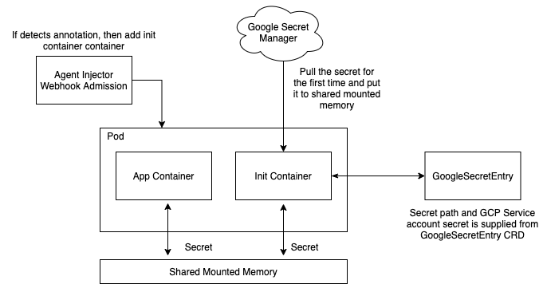

Google Secret Kubernetes
===

Kubernetes based CRD and controller for synchronizing google secret manager data to application runs on kubernetes. This makes Google Secret Manager as the first class citizen of Kubernetes. 

Credits: This project is inspired by Hashicorp's [vault-k8s](https://github.com/hashicorp/vault-k8s) project. This project uses some code/components from that repository. However it is used to fetch secret from Google Secret Manager instead of Vault.

---

This project creates a kubernetes controller and an operator named `GoogleSecretEntry` to store these informations: 
1. Kubernetes `Secret` name and the key used to store base64 encoded string of GCP service account key.
1. Path to the secret in [Google Secret Manager](https://cloud.google.com/secret-manager) and the name of the file where the secret will be written in the `Pod`'s mounted memory.

Besides that controller, this project creates another RESTful service which uses [Kubernetes Admission Controller](https://kubernetes.io/blog/2019/03/21/a-guide-to-kubernetes-admission-controllers/) feature to intercept the creation of an Pod and mutate the pod definition to add an init container. This init container later is used to fetch the credentials from Google Secret Manager and store it to `/google/secrets` directory by default. This removes the user needs to put logics to fetch the secret from the code. 




## Installation

```bash
$ kubectl create namespace secret-operator-system
$ helm install gsecret-k8s charts/gsecret-k8s --namespace secret-operator-system
```

## Usage

* As Google Cloud authenticates the client by using service account and its json key. We need to create a Kubernetes `Secret` to store this information. 

Assuming that you are creating a `Secret` name `mysecret` whose `data` with `sa-key.json` and base64 encoded values of the service account key.

```yaml
apiVersion: v1
kind: Secret
metadata:
  name: mysecret
  namespace: default
type: Opaque
data:
  sa-key.json: <BASE64_ENCODED_GCP_SERVICE_ACCOUNT_KEY>
``` 

Run:
```bash
$ kubectl apply -f mysecret.yaml
```

1. Create a `GoogleSecretEntry` Custom Resoruce to store the reference to the secret created on previous steps and list of secret path you want to fetch for the application. 

    The example below shows that you will fetch a secret stored in Google Secret Manager with path `projects/imre-demo/secrets/db_creds/versions/latest` and then store the data to a file name `db-creds` in directory named `/google/secrets` on the application container.

```yaml
apiVersion: secret.security.imrenagi.com/v1alpha1
kind: GoogleSecretEntry
metadata:
  name: googlesecretentry-sample
  namespace: default
spec:
  secretRef:
    name: mysecret
    namespace: default
    key: sa-key.json
  secrets:
  - path: projects/imre-demo/secrets/db_creds/versions/latest
    name: db-creds
```
Run:
```bash
$ kubectl apply -f googlesecretentry.yaml
```

* Bind this role to Kubernetes `ServiceAccount` you use for your applications. To learn more about RoleBinding, take a look [here](https://kubernetes.io/docs/reference/access-authn-authz/rbac/#rolebinding-and-clusterrolebinding).

    This `RoleBinding` is necessary since the init container will have to do `GET` call to Kubernetes API to retrieve the `Secret` and `GoogleSecretEntry`.

```yaml
apiVersion: rbac.authorization.k8s.io/v1
kind: Role
metadata:
  name: gsecret-agent-role
  labels:
    app.kubernetes.io/name: static-web
rules:
- apiGroups: [""]
  resources: ["secrets"]
  verbs: 
    - "get"
- apiGroups:
  - secret.security.imrenagi.com
  resources:
  - googlesecretentries
  verbs:
  - get
  - list
  - watch
- apiGroups:
  - secret.security.imrenagi.com
  resources:
  - googlesecretentries/status
  verbs:
  - get
```

* Add the following extra annotations to your pods. For complete example take a look this [file](./agent-inject/sample/pod.yaml):

```yaml
apiVersion: v1
kind: Pod
metadata:
  ...
  annotations:
    google.secret.security.imrenagi.com/agent-inject: "true"
    google.secret.security.imrenagi.com/agent-google-secret-crd: "googlesecretentry-sample"
```

Run:
```bash
$ kubectl apply -f pod.yaml
```

Once the pod is created, you should see the pod starts with an init container.

To see all supported annotations, please refer to this [file](./agent-inject/injector/agent/annotations.go)

The annotations above are used by the agent-injector to decide whether to mutate the `Pod` definition with additional an init container. This init container will fetch the secret defined from Google Secret Manager before your application starts.